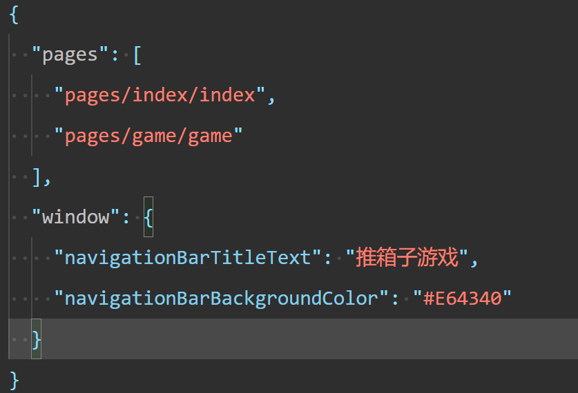
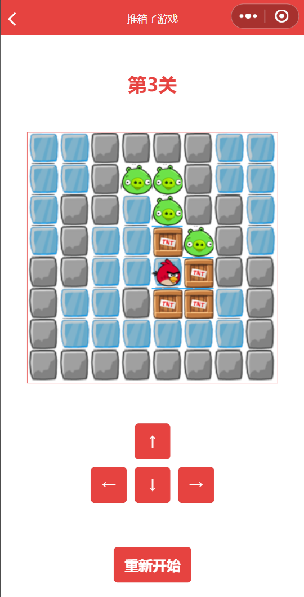
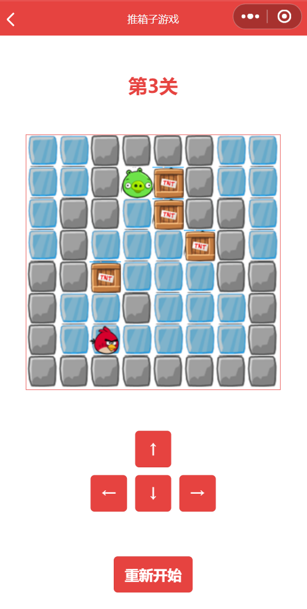
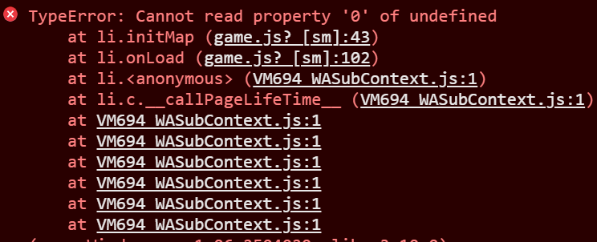

# 2025年夏季《移动软件开发》实验报告


<center>姓名：陈怡冰  学号：23020007007</center>

| 姓名和学号？         | 陈怡冰，23020007007                                          |
| -------------------- | ------------------------------------------------------------ |
| 本实验属于哪门课程？ | 中国海洋大学25夏《移动软件开发》                             |
| 实验名称？           | 实验6：推箱子游戏                                            |
| 博客地址？           | [OUC-2025年夏季《移动软件开发》实验报告-实验六-CSDN博客](https://blog.csdn.net/2301_81554020/article/details/151353786?sharetype=blogdetail&sharerId=151353786&sharerefer=PC&sharesource=2301_81554020&spm=1011.2480.3001.8118) |
| Github仓库地址？     | [ChenFirstIce/Mobile-software-development-for-the-summer-semester-of-2025: OUC-2025夏季学期《移动软件开发》课程的六个实验以及个人项目的课程报告以及代码。主要是使用微信小程序开发工具开发微信小程序，并涉及到一点鸿蒙系统。](https://github.com/ChenFirstIce/Mobile-software-development-for-the-summer-semester-of-2025/tree/main) |

（备注：将实验报告发布在博客、代码公开至 github 是 **加分项**，不是必须做的）


## **一、实验目标**

1、综合所学知识创建完整的推箱子游戏；

2、能够在开发过程中熟练掌握真机预览、调试等操作。

## 二、实验步骤

### 2.1 创建项目

1. 步骤和前面的实验都一样，不再赘述

2. 添加`game`文件夹，并修改全局的`app.json`设置。

   

3. 最后具体的目录结构如下：

​	

### 2.2 页面设计

- 首页页面

  1. 根据实验文档设计静态页面。主要是分成两个部分：文本部分和图片部分，其中文本部分在上，图片部分在下

     ```xml
     <view class='container'>
       <!--标题-->
       <view class='title'>游戏通关</view>
       <!--关卡列表-->
         <view class='levelBox'>
         <view class='box'>
           <image src = '/images/level01.png'></image>
           <text>第1关</text>
         </view>
       </view>
     
     </view>
     ```

     

  2. 然后设计页面的样式。修改`app.wxss`，设置容器`container`的公共样式以及顶端的标题`title`

      ```css
      .levelBox{
        width: 100%;
      }
      
      .box{
        width: 50%;
        float: left;
        margin: 20rpx 0;
        display: flex;
        flex-direction: column;
        align-items: center;
      }
      
      image{
        width: 300rpx;
        height: 300rpx;
      }
      ```

  

  


- 游戏页面设计

  1. 设置编辑模式，方便设计在没有实现跳转逻辑的情况下进行编译。

     

  2. 设计游戏界面，包括三个部分：标题、游戏画布、方向键&重新开始的按钮

     - 游戏画布部分，设计画布的id为`myCanvas`

     ```html
     <view class='container'>
       <!--关卡提示-->
       <view class='title'>第1关</view>
       
       <canvas canvas-id='myCanvas'></canvas>
     
       <!--方向键-->
       <view class='btnBox'>
         <button type='warn' bindtap='up'>↑</button>
         <view>
           <button type='warn' bindtap='left'>←</button>
           <button type='warn' bindtap='down'>↓</button>
           <button type='warn' bindtap='right'>→</button>
         </view>
       </view>
         <!--按钮-->
         <button type='warn' bindtap='restartGame'>重新开始</button>
     </view>
     ```

     

  3. 设计游戏界面的样式，包括：画布、所有按钮

     ```css
     canvas{
       border: 3rpx solid;
       width: 320px;
       height: 320px;
     }
     
     .btnBox{
       display: flex;
       flex-direction: column;
       align-items: center;
     }
     
     .btnBox view{
       display: flex;
       flex-direction: row;
     }
     
     .btnBox button{
       width: 90rpx;
       height: 90rpx;
     }
     
     button{
       margin: 10rpx;
     }
     ```

     

### 2.3 逻辑实现

- 公共逻辑（data.js）

  1. 在公共的JS文件`utils/data.js`中设置地图的数据

     - 地图`map`是一个**8*8**的二维数组，不同的数字代表不同的icon
     - 1：墙；2：路（ice）；3：终点（pig）；4：箱子；5：人物（bird）；0：墙的外围

  2. 同时使用`module.exports`语句暴露map变量

     ```js
     /*1：墙 2：路 3：猪（终点） 4：箱子 5：小鸟 0：墙的外围*/
     
     var mapl=[
       [0,1,1,1,1,1,0,0],
       [0,1,2,2,1,1,1,0],
       [0,1,5,4,2,2,1,0],
       [1,1,1,2,1,2,1,1],
       [1,3,1,2,1,2,2,1],
       [1,3,4,2,2,1,2,1],
       [1,3,2,2,2,4,2,1],
       [1,1,1,1,1,1,1,1]
     ]
     
     var map2=[
       [0,0,1,1,1,0,0,0],
       [0,0,1,3,1,0,0,0],
       [0,0,1,2,1,1,1,1],
       [1,1,1,4,2,4,3,1],
       [1,3,2,4,5,1,1,1],
       [1,1,1,1,4,1,0,0],
       [0,0,0,1,3,1,0,0],
       [0,0,1,1,1,0,0,0]
     ]
     
     var map3 =[
       [0,0,1,1,1,1,0,0],
       [0,0,1,3,3,1,0,0],
       [0,1,1,2,3,1,1,0],
       [0,1,2,2,4,3,1,0],
       [1,1,2,2,5,4,1,1],
       [1,2,2,1,4,4,2,1],
       [1,2,2,2,2,2,2,1],
       [1,1,1,1,1,1,1,1]
     ]
     
     var map4 =[
       [0,1,1,1,1,1,1,0],
       [0,1,3,2,3,3,1,0],
       [0,1,3,2,4,3,1,0],
       [1,1,1,2,2,4,1,1],
       [1,2,4,2,2,4,2,1],
       [1,2,1,4,1,1,2,1],
       [1,2,2,2,5,2,2,1],
       [1,1,1,1,1,1,1,1]
     ]
     
     module.exports = {
       maps:[mapl, map2, map3, map4]
     }
     ```

  3. 最后需要`pages/game/game.js`的顶端引用公共JS文件，**且文件的路径必须是相对路径，`..`表示上一个目录**

     ```js
     var data = require('../../utils/data.js')
     ```

     

- 首页逻辑

  1. 关卡列表展示

     - 设置变量数组`levels`，使其包含各个关卡初始图片的名称
     - 在页面`index.wxml`的图片部分添加`wx:for`循环，显示关卡列表`levels`的数据和图片。
       - index：数组下标
       - item：列表当前下标的内容

     ```xml
     <view class='container'>
       <!--标题-->
       <view class='title'>游戏通关</view>
       <!--关卡列表-->
         <view class='levelBox'>
         <!--增加循环，循环所有关卡，并设置跳转函数-->
         <view class='box' wx:for='{{levels}}' wx:key='levels{{index}}' bindtap='choosLevel' data-level = '{{index}}'>
           <image src = '/images/{{item}}'></image>
           <text>第{{index + 1}}关</text>
         </view>
       </view>
     
     </view>
     ```

     

  2. 点击跳转游戏页面

     - 设置点击图片部分即可完成跳转，设置事件`chooseLevel`，并通过data-level传送变量`index`
     - `chooseLevel`函数的内容
       - 使用`e.currentTarget.dataset.level`获取变量`index`
       - 通过微信组件`wx:navigateTo`进行url跳转到相应关卡的页面

     ```js
       choosLevel: function(e){
         let level = e.currentTarget.dataset.level
         //页面跳转
         wx.navigateTo({
           url:'../game/game?level=' + level
         })
       },
     ```

### 2.4 游戏页逻辑

- 动态页面设计

  1. 显示当前是第几关

     - 设置变量`level`
     - 修改生命周期函数，获取`url:'../game/game?level=' + level`中的`level`
     - 更新关卡页面（因为`level`是传入的`index`，所以显示关卡数应当+1）

     ```js
     Page({
     
       /**
        * 页面的初始数据
        */
       data: {
         levels: [
           'level01.png',
           'level02.png',
           'level03.png',
           'level04.png'
         ]
       },
     
       choosLevel: function(e){
         let level = e.currentTarget.dataset.level
         //页面跳转
         wx.navigateTo({
           url:'../game/game?level=' + level
         })
       },
     )}
     ```

     

- 游戏地图的绘制

  1. 初始化变量

     - **地图map和箱子box的图层是分开的，是箱子的图层叠加到地图上**，都初始化为全0的二维数组
     - 初始化人物（bird）的所在的行与列

  2. 初始化游戏界面

     - 读取`data.js`暴露的`maps`中的地图数据，其中：
       - 如果`mapData[i][j] == 4`说明是箱子，标记`box`记录为箱子的初始位置以及标记`map`记录为道路的位置
       - 如果`mapData[i][j] == 5`说明是人物的位置
       - 其他的都按照`mapData`进行标注即可

     ```js
       //初始化地图，并修改box中box的位置以及map中小鸟的位置
       initMap: function(level){
         let mapData = data.maps[level]//获得data.js中的数据
         for(var i = 0;i < 8;i++){
           for(var j = 0;j < 8;j++){
             box[i][j] = 0
             map[i][j] = mapData[i][j]
     
             if(mapData[i][j] == 4){
               box[i][j] = 4
               map[i][j] = 2//最底层画布的地图中，箱子在的位置表示为路 (ice)
             }else if(mapData[i][j] == 5){
               map[i][j] = 2//最底层画布的地图中，箱子在的位置表示为路（ice）
               row = i
               col = j
             }
           }
         }
       },
     ```

  3. 绘制地图

     - 再生命周期函数中创建画布上下文

     ```js
     onLoad(options) {
         //获得关卡
         let level = options.level//从‘url：？level = ’获得level的值
         //更新页面关卡标题
         this.setData({
           level: parseInt(level) + 1
         })
         //创建画布上下文
         this.ctx = wx.createCanvasContext('myCanvas')
         this.initMap(level)
         this.drawCanvas()
     },
     ```

     

     - 先绘制`map`中的元素，再绘制`box`中的元素进行叠加

     ```js
     drawCanvas: function(){
         let ctx = this.ctx
         ctx.clearRect(0,0,320,320)//y, x, y边界, x边界
     
         //一个格子一个格子的循环，地图
         for(var i = 0;i < 8;i++){
           for(var j = 0;j < 8;j++){
             let img = 'ice' //默认是路（ice）
             if(map[i][j] == 1){
               img = 'stone'
             }else if(map[i][j] == 3){
               img = 'pig'
             }
     
             //绘制地图，在该地点刷新图片
             ctx.drawImage('/images/icons/' + img + '.png', j * w, i * w, w, w)
     
             if(box[i][j] == 4){
               //在原地图是ice的基础上，叠加绘制箱子
               ctx.drawImage('/images/icons/box.png', j * w, i * w, w, w)
         }
       }
     }
     ```

- 方向键逻辑

  1. 给方向键设置事件（添加自定义函数）

  2. 实现自定义函数：每点击一下方向键就在条件允许的情况下移动一格

     以函数`up`为例，具体的逻辑写在注释里了。

     ```js
       up:function(){
         //如果不在边界才能操作
         if(row > 0){
           //上面不能是石头和箱子
           if(map[row - 1][col] != 1 && box[row - 1][col] != 4){
             row = row - 1
           }else if(box[row - 1][col] == 4){//如果上面是箱子，就要判断是否能够推动箱子
             if(row - 1 > 0){//上上面不是边界
               if(map[row - 2][col] != 1 && box[row - 2][col] != 4){//上上面没有路障
                 box[row - 2][col] = 4//可以向上推动箱子
                 box[row - 1][col] = 0
     
                 //更新小鸟的坐标
                 row = row - 1
               }
             }
           }
           //重新绘制
           this.drawCanvas()
           this.checkWin()
         }
       },
     ```

  3. 判断游戏成功

     - 游戏成功的标志就是：所有箱子都在终点，只要检查`box`中箱子的位置是不是都和`map`中的终点位置一致即可

       ```js
       isWin:function(){
           for(var i = 0;i < 8;i++){
             for(var j = 0;j < 8;j++){
               if(box[i][j] == 4 && map[i][j] != 3){//判断箱子的位置和猪（终点）的位置是否重合即可
                 return false
               }
             }
           }
           return true
       },
       ```

     - 增加一个弹窗，一档游戏成功就弹出提示对话框

       ```js
       checkWin:function(){
       if(this.isWin()){
         wx.showModal({
           title: 'WIN',
           content: '你赢了🐂',
           showCancel:false
         })
       }
       },
       ```

     - 每走一次就检查一次是否赢了

- 重新开始逻辑

  1. 重新开始游戏即，初始化地图数据+刷新画布内容

     ```js
     restartGame:function(){
         this.initMap(this.data.level - 1)//因为maps下标从0开始
         this.drawCanvas()
     },
     ```

     

## 三、程序运行结果







## 四、问题总结与体会

### 问题一：不能读取`maps`，显示下标未定义



### 解决方案

因为没有在`pages/game/game.js`中添加

```js
	var data = require('../../utils/data.js')
```
导致没有读取到`data.js`中的内容


### 心得体会

本次推箱子游戏开发让我对微信小程序开发有了更实的掌握。从页面设计到逻辑实现，分层思想让代码更清晰。解决“无法读取maps”的问题，让我深知路径引用细节的重要性。方向键逻辑实现锻炼了逻辑严谨性，也让我更注重用户体验，收获颇丰。